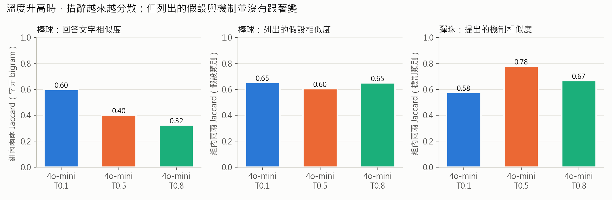
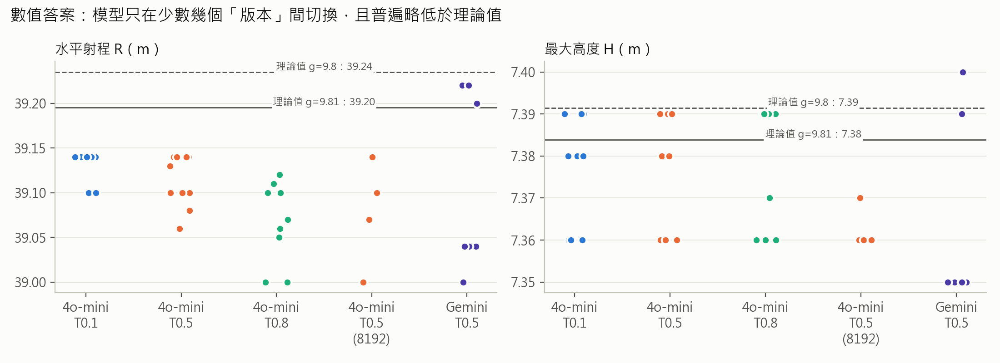
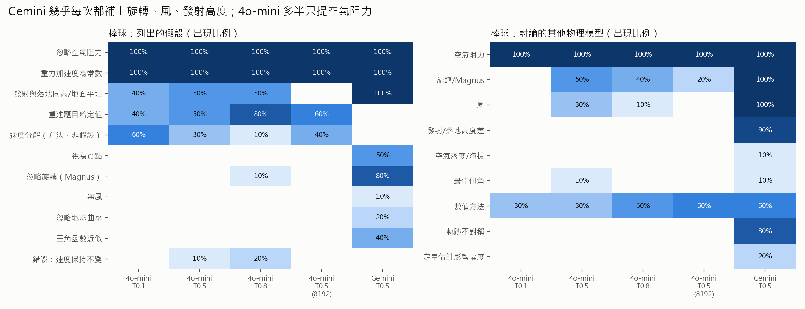
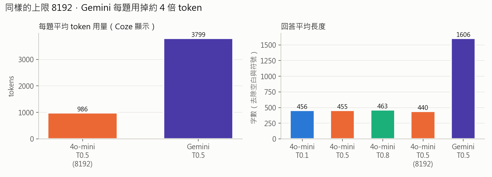
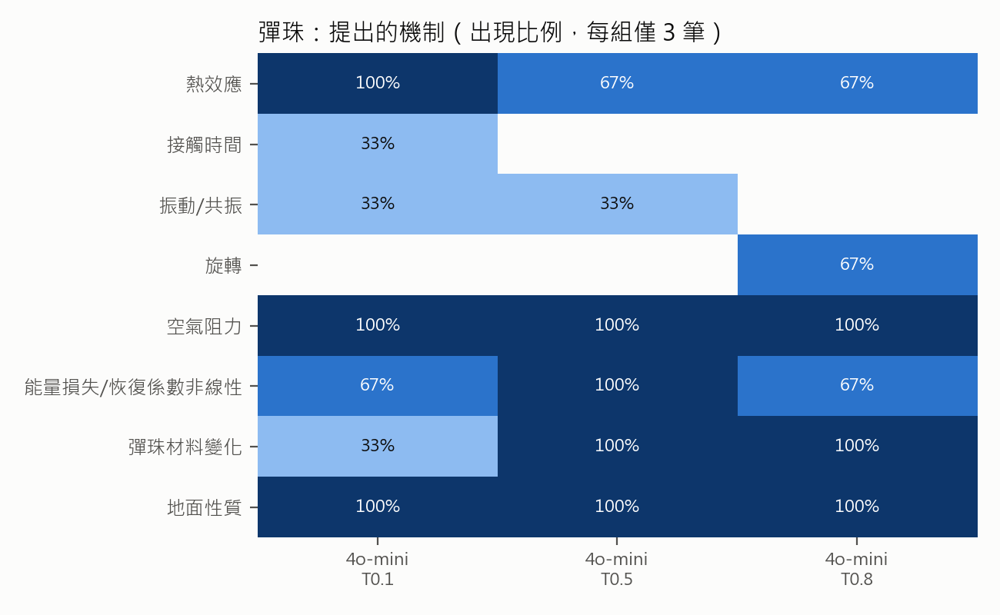

# Unit 1 實驗分析結果：Temperature 與模型選擇對 LLM 回答行為的影響

> 本文件是**數據與分析素材**，不是最終繳交的報告。報告開頭的「自己消化後的結論」與「用自己的話定義名詞」請自行撰寫（見文末〈報告架構建議〉）。
> 所有數字都可以用 `python analyze.py` 重現；逐筆資料在 `results/`，圖在 `figures/`。

---

## 一、實驗設定與資料

| 組別 | 模型 | Temperature | Max length | 題目 | 有效樣本 |
|---|---|---|---|---|---|
| 4o-mini T0.1 / T0.5 / T0.8 | GPT-4o mini | 0.1 / 0.5 / 0.8 | 1024 | 棒球（拋體計算） | 各 10 |
| 4o-mini T0.5 (8192) | GPT-4o mini | 0.5 | 8192 | 棒球 | 5 |
| Gemini T0.5 | Gemini Flash 2.0 | 0.5 | 8192 | 棒球 | 10 |
| 4o-mini T0.1 / T0.5 / T0.8 | GPT-4o mini | 0.1 / 0.5 / 0.8 | 1024 | 彈珠（開放式機制題） | 各 3 |

**排除的樣本：**
- 棒球 T01 第 10 筆、T05 第 7 筆：誤用 GPT-4o。
- Gemini 第 1～3 筆：max length 為 1024 或 4096 時，回答被截斷。

**棒球題的理論值**（忽略空氣阻力）：

| | g = 9.81 | g = 9.8 |
|---|---|---|
| 最大高度 H | 7.384 m | 7.391 m |
| 水平射程 R | 39.195 m | 39.235 m |

---

## 二、分析方法

| 指標 | 做法 | 用來回答什麼 |
|---|---|---|
| **文字 Jaccard** | 把每筆回答切成「相鄰兩字」的集合（字元 bigram），同組兩兩計算 交集÷聯集，再取平均 | 同一題問很多次，**措辭**有多像？ |
| **假設／機制集合 Jaccard** | 把每筆回答列出的假設（或機制）歸類成類別，再對類別集合算 Jaccard | 同一題問很多次，**內容**有多像？ |
| **數值答案** | 抽出最終的 H、R，和理論值比較；另外拿模型自己寫的 `R = v_x × t` 重新相乘，檢查最後一步乘法 | 答案準不準？穩不穩？模型是否真的在計算？ |
| **錯誤標記** | 用關鍵字找出事實或物理錯誤，逐筆人工確認 | 溫度或模型會不會帶來更多錯誤？ |
| **長度／token** | 字數（去掉空白與符號）；token 數取自 Coze 介面顯示 | 成本差多少？ |

> 分類是用關鍵字規則自動編碼，規則寫在 `analyze.py` 的 `*_RULES`。棒球題的逐筆結果已人工核對，但仍可能有少數邊界案例歸類不完美。

---

## 三、發現

### 發現 1：溫度改變的是「措辭」，不是「內容」

| | T0.1 | T0.5 | T0.8 |
|---|---|---|---|
| 棒球：文字 Jaccard | **0.60** | 0.40 | **0.32** |
| 棒球：假設集合 Jaccard | 0.65 | 0.60 | 0.65 |
| 彈珠：文字 Jaccard | 0.35 | 0.24 | 0.21 |
| 彈珠：機制集合 Jaccard | 0.58 | 0.78 | 0.67 |

- **文字相似度隨溫度單調下降**，兩題都是如此。T0.1 的回答彼此相似度是 0.60，但拿去和 T0.8 的回答比，只剩 0.36：溫度一拉高，就離低溫時的「標準說法」越來越遠。
- **內容相似度沒有隨溫度變化。** 每一組都 100% 列出「忽略空氣阻力」和「g 為常數」；彈珠題每一筆都提到空氣阻力和地面性質。
- **解讀：** temperature 控制的是每個字被選中的隨機程度，所以最先受影響的是用字和句型。至於「該列哪些假設」這種較高層的內容，在 0.1～0.8 的範圍內幾乎沒有被撼動。
- 彈珠題每組只有 3 筆，機制 Jaccard 的起伏（0.58 → 0.78 → 0.67）不足以判斷趨勢。

### 發現 2：低溫是「一致地錯」，高溫是「分散地錯」

| | T0.1 | T0.5 | T0.8 |
|---|---|---|---|
| R 標準差 | 0.019 | 0.029 | 0.042 |
| R 出現幾種不同數值 | 2 | 5 | 7 |
| 最後一步乘法算錯的筆數 | 7 / 10 | 6 / 10 | 7 / 10 |
| 算錯時出現幾種不同答案 | **1** | 3 | **6** |

- **4o-mini 的 35 筆回答，沒有一筆算出理論值 39.20 m。** 所有答案都落在 39.00～39.14 m。
- 答案偏低的原因是中間步驟捨入。模型把飛行時間寫成 2.45 s（實際是 2.4539 s），部分回答還把 cos 37° 截位成 0.798。
- 真正關鍵的是**最後一步乘法**：
  - T0.1 有 7 筆寫出 `15.97 × 2.45 ≈ 39.14`，但正確結果是 **39.13**。7 次犯的是**同一個錯**。
  - T0.8 同樣是 `15.96 × 2.45`（正確為 39.10），卻出現 39.05、39.06、39.07 等答案，**錯法各不相同**。
- 同樣的現象也出現在 H：`144.96 ÷ 19.62 = 7.388`，應該寫成 7.39，卻有 5 筆寫成 7.38。
- **解讀：** 模型並沒有真的在「計算」，而是在生成**看起來像計算結果的數字**。低溫時，它穩定地選出同一串數字，即使那串數字是錯的；高溫時，選到的數字就散開了。
- **對 Agent 設計的意義：** 把 temperature 調低只能讓回答**一致**，不能讓回答**正確**。需要精確數值的場景（例如客服報價、計算運費），應該讓 Agent 呼叫計算工具（Plugin），而不是讓 LLM 自己算。這正好對應課綱單元 5 的 Plugin-Tool。

### 發現 3：溫度升高，物理錯誤變多

| 錯誤 | T0.1 | T0.5 | T0.8 |
|---|---|---|---|
| 把「初速度不變」列為假設（物理錯誤：只有水平分量不變） | | 1 | 2 |
| 算術錯誤 `12.04² = 145.06`（正確為 144.96） | | | 1 |
| 捏造名詞「德雷克效應」（應為馬格努斯效應） | | | 1 |
| **有錯誤的回答** | **0 / 10** | **1 / 10** | **4 / 10** |

- 低溫時模型選的是機率最高的字，通常也是教科書最常見的說法，所以比較不會出錯。溫度升高後，機率較低的字也有機會被選中，偶爾就會組出錯誤的敘述或不存在的名詞。
- 注意：每組只有 10 筆，這是趨勢觀察，不是統計上的證明。

### 發現 4：兩個模型的差別在「廣度」與「成本」，不在「正確率」

比較條件：同為 T0.5、max length 8192。

| | 4o-mini | Gemini Flash 2.0 |
|---|---|---|
| 每題平均 token | 986 | **3,799**（約 3.9 倍） |
| 平均字數 | 440 | 1,606 |
| 平均列出的假設數 | 3.0 | 5.0 |
| 平均討論的其他模型數 | 1.8 | **5.7** |
| 提到旋轉／Magnus 效應 | 20% | 100% |
| 提到發射高度差 | 0% | 90% |
| 說明軌跡不對稱 | 0% | 80% |

- **Gemini 想得比較廣。** 幾乎每次都主動補上旋轉、風、發射高度，還有 20% 的回答給出量化估計，例如「射程可能減少 30%～50%」。
- **但 Gemini 有自己的錯誤：**
  - **術語前後矛盾**：第 4～9 筆把「上旋」標成 Backspin，第 10～13 筆又正確寫成「下旋 (Backspin)」。同一個模型、同一個設定，對同一個名詞給出相反的定義。
  - **7 / 10 筆使用 sin 37° ≈ 0.6、cos 37° ≈ 0.8 的高中近似值**，所以答案是 39.04 m。另外 3 筆用 0.7986，答案 39.22 m，最接近理論值。
  - **第 9 筆回答開頭冒出「現在是 2026 年 9 月 28 日…」**：推測是 Coze 平台把當下時間注入到了系統提示中。
- **為什麼 Gemini 的文字 Jaccard 比較低（0.29 vs 0.43）？** 回答越長，能用的字就越多，兩篇文章的 bigram 重疊比例自然會下降。所以這個數字**不能直接解讀成 Gemini 比較不穩定**。

> ⚠️ **這組比較不是「大模型 vs 小模型」。** GPT-4o mini 和 Gemini Flash 2.0 都沒有公開參數量，兩者都是各家的輕量級模型，所以只能說是**兩個不同廠商的模型**。要比較模型大小，需要同一家的大小兩版（例如 GPT-4o vs GPT-4o mini）在相同設定下重做。

### 發現 5：Max length 是「上限」，不是「目標長度」

- 4o-mini 在 max length 1024 和 8192 下，平均字數幾乎一樣（455 vs 440），token 用量都約 1,000。
- Gemini 在 1024 和 4096 下被截斷，因為它完整回答需要 2,400～4,600 token。
- **解讀：** 回答長度由模型本身的習慣決定。Max length 只是一道「截斷線」，設太低會讓回答被切掉，設高了也不會讓回答變長。這驗證了你在 `說明.txt` 裡記錄的觀察。

### 發現 6：彈珠題（開放式問題）

- 9 筆回答都有提到空氣阻力和地面性質，也都遵守了「不能更換彈珠」的限制。
- T0.8 開始出現「旋轉」機制（3 筆中有 2 筆），T0.1 和 T0.5 完全沒有。這和發現 3「高溫會選到較少見的內容」方向一致，但只有 3 筆，只能當作觀察。
- **以下是我（Claude）的物理判斷，請自行查證：** 多數實驗設計無法真正區分「哪個機制最重要」。
  - 「換地面材料」會同時改變好幾個變因。
  - 「用風扇或風洞測空氣阻力」測到的是風，不是阻力。
  - 沒有任何回答提到**量測本身的解析度**：彈跳很低時，每次落地的時間間隔很短，用聲音或影片判斷次數和高度本身就會有誤差。

---

## 四、和 Coze 平台設計的對應（呼應「為什麼平台提供多種模型」）

| 觀察 | 對 Agent 設計者的意義 |
|---|---|
| 低溫＝一致，但一致≠正確（發現 2） | 需要**穩定一致**的客服回答時用低溫；需要**精確數值**時，交給工具計算 |
| 高溫帶來較多錯誤與少見內容（發現 3、6） | 需要創意發想時可以提高溫度，但要搭配檢查機制，例如 Guardrail |
| Gemini 較廣但 token 多 3.9 倍（發現 4） | 模型選擇是**成本、完整度、速度**之間的取捨，這正是平台提供多種模型的原因 |
| Max length 只是上限（發現 5） | 設太低會截斷回答，要依照模型的回答習慣來設定 |

課綱「老師的認知」欄提到：「精準度、成本與反應時間等，就成為 agent 設計者必須要在意的事」。這份數據可以直接支撐這句話。

---

## 五、限制

1. **樣本數少**：棒球每組 10 筆，彈珠每組 3 筆。可以看出趨勢，但不足以做統計檢定。
2. **模型比較不是大小比較**（見發現 4 的說明）。
3. **Gemini 的 max length 前後不一致**：第 1～3 筆用 1024 或 4096，已排除。
4. **分類靠關鍵字規則**：棒球題已逐筆人工核對；彈珠題樣本少，分類較粗。
5. **文字 Jaccard 會受回答長度影響**：只適合用在長度相近的組別之間比較，例如 4o-mini 的三個溫度。

---

## 六、報告架構建議（依老師要求）

> 標 ✍️ 的部分**必須由你自己寫**。老師要求「自己消化後的結論」和「用自己的話定義名詞」。

1. **老師上次的回饋**：引用老師對 Unit 0 的回覆，說明這週為什麼選擇回到 Unit 1。
2. ✍️ **本週結論與思考摘要**：放在最前面，3～5 句話。
3. **問題（故事化）**：例如「同一題物理問 AI 十次，答案會一樣嗎？如果不一樣，是『想法』不同，還是『說法』不同？」
4. ✍️ **名詞定義與關聯**：temperature、top-p、max length、token、context rounds，以及它們之間的關係。例如 max length 和 token 的關係、temperature 和 top-p 都在控制什麼。
5. **實作截圖**：`溫度/` 資料夾中的 Coze 設定畫面（Model settings、Temperature 滑桿、Preview & Debug 的 token 與秒數）。
6. **實驗設計**：兩道題、三個溫度、兩個模型、排除了哪些樣本。
7. **數據與發現**：挑 3～4 個最有說服力的發現，建議用發現 1、2、4。
8. **AI 的解釋 vs 我的觀察**：可以對照其他 AI 先前生成的報告和這份數據分析，哪些說法有數據支撐，哪些沒有。
9. **對 Agent 設計的意義**：第四節的表格。
10. **限制與下一步**：銜接客服 Agent 的實作。
